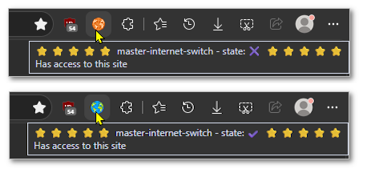

<h3> master-internet-switch</h3>

start up your browser with internet blocked,  
toggle allow/block by clicking the web-extension's icon.  

  


[Watch the demo](./screenshot3.mp4)


<hr/>

<details><summary>session restore, use-case:</summary>

works great especially when restoring previous sessions  
with large amount of tabs and windows.  

while Firefox/TOR browsers, are capable, of restoring sessions in a "lazy" mode,  
where tabs - only loads-up (automatically) once you switch to them,  
chromium based browsers still haven't implemented it,  
so normally there is a huge jump in CPU and RAM consumption,  
and something the whole browser (and/or system) freezes up.  

..so, this web-extension allows you to always load-up all the tabs and windows,  
but have the internet disabled by default at first,  
then you wait until the session is loaded,  
click the web-extension icon, to enable the internet,  
and select and manually refresh tab yourself,  

overall - consuming minimal CPU and RAM.  

</details>


<details><summary>Developer's Notes:</summary>

- I try my best to clear up the document when the internet is disabled,  
as various elements might be cached and displayed in a messy way. this is the reason  
for asking host permission with `<all_urls>` and running `content_script.js` in every page.  
there is also a small delay while `content_script.js` verifies the state of the internet (blocked/allowed),  
by sending a message to the service worker (`sw.js`).  
this designed to reduce the overall RAM consumption of the tab, and normalize the visibility to blank page,  
while preserving the actual URL and origin of the page.  
some other web-extensions might consider to redirect to a blank page,  
I actually run a little code to verify document is cleared very early in page's life-cycle (`document_start`).  
the code won't run if you clicked while the page's already started to load, which is by design.  
if the page has already loaded, it would be displayed.

- even though the web-extension handles "the internet",  
it actually does not handle connection, but built around `declarativeNetRequest`,  
and a static ruleset to block all types of connections, started `enabled:true` by default.  
works globally, and does not need the web-extension to actually work as it is handled by the browser.  
so no information actually pass-through the web-extensions.  

- some websites will be successfully blanked, other will display error 503 for a few seconds then blanked,  
other (mostly, when they have some kind of an offline component or manifest) would display  
"this website got blocked by a web-extension". all are the same.  

- the ruleset includes explicitly `"urlFilter" : "*"` to match every page,  
but with only that, some cached component were implicitly still loaded up,  
which wasn't all bad since it didn't actually a result of a network connection, just cache.  
but by adding resource type explicitly (in here it is sorted by a-b-c order):  

```json
"resourceTypes" : [
 "csp_report"
,"font"
,"image"
,"main_frame"
,"media"
,"object"
,"other"
,"ping"
,"script"
,"stylesheet"
,"sub_frame"
,"webbundle"
,"websocket"
,"webtransport"
,"xmlhttprequest"
]
```

it seems to perfectly block, explicitly, most of cached resources too.  
this is better in more ways than one since there are background-connections,  
that are technically triggered by a page, but continue as background connection,  
for example "ping", and probably websocket.  
having the internet blocked (which is a global state, not a "per tab" state),  
taking care of blocking those as well. it kind-of feels more like a firewall now..

</details>

<hr/>

- zero configuration.
- works offline.
- does not modify any data nor requests, not aware of any data, will not touch cookies and storage.
- no data collections, no analytics, no ads, full, free.
- open-source. MIT license.

<a href="https://paypal.me/31adkarak0" target="_blank" rel="noopener noreferrer"><br/></a>

<hr/>
<br/> 

